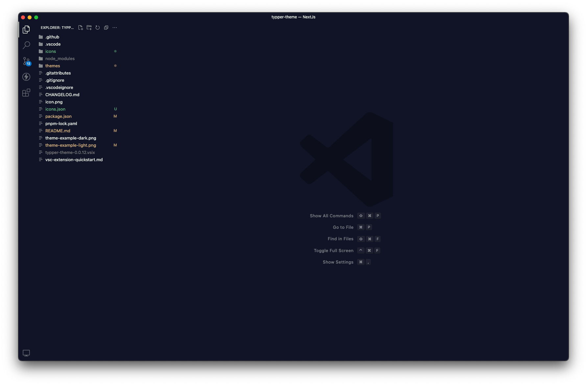

# Typper Theme for Visual Studio Code

Welcome to the Typper theme for VS Code, a theme extension inspired by the aesthetics of one of the most innovative startups in artificial intelligence. Merging elegance with functionality, the Typper theme is more than just a color choice; it's a complete user experience that enhances your coding environment.




## Installation

1. Open **Visual Studio Code**.
2. Press `Ctrl+P` to open the Quick Command palette.
3. Paste `ext install typper-theme` and press `Enter`.
4. Go to `Preferences > Color Theme` and select **Typper** from the list.

## Configuration Recommendations

For an even more immersive experience, we recommend combining the Typper theme with the following settings:

```json
{
  "workbench.iconTheme": "minimal-icons",
  "workbench.colorTheme": "Typper",
  "window.commandCenter": false,
  "workbench.layoutControl.enabled": false,
  "workbench.statusBar.visible": false,
  "editor.minimap.enabled": false
}
```

Copy and paste these settings into your settings.json file to optimize your user interface.

## Contributing

We love your contributions and suggestions! If you have ideas for improving the theme or have found a bug, please open an issue or a pull request on our GitHub repository.

## License

This theme is distributed under the MIT license. See the LICENSE file in our GitHub repository for more details.

Enjoy a more beautiful and productive coding experience with the Typper theme for VS Code!
